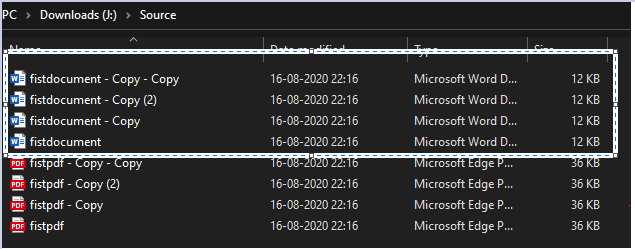
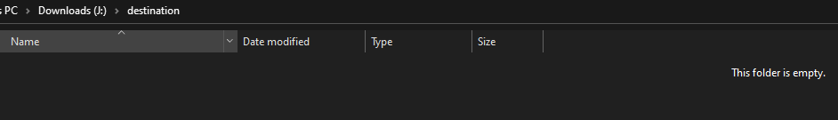
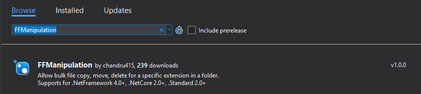
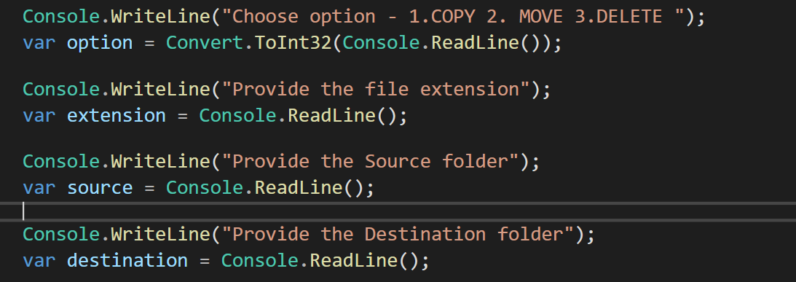
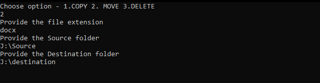
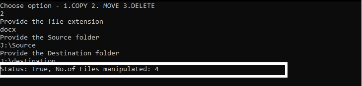
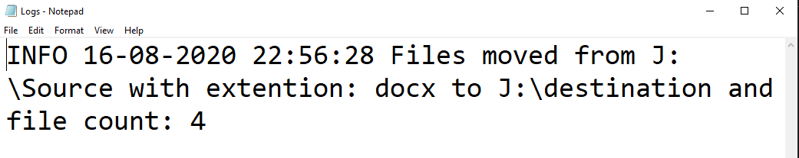
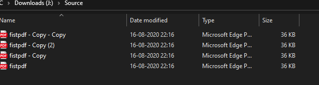
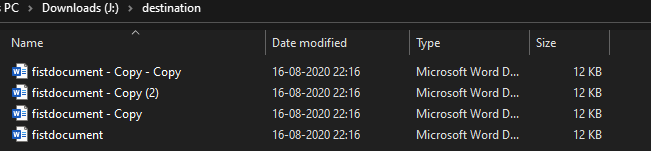

 <h2 align="center">FilterFileManipulation</h2>
 
C# Class library project. To perform actions like COPY, MOVE, DELETE under given file extension</b>

  
 

 
 
  
 

 

---

 **FilterFileManipulation** gives the ability to perform action like *copy*, *move*, *delete* on file(s) based on the desire *file extension*. 

To install the ***package*** to any .Net Framework or .Net Core application please click [here](https://www.nuget.org/packages/FFManipulation/).

<h5>Use case: Filter File Manipulation </h5>

 let we have to move(cut) only documents(.docx) file from one folder to another folder.

To achieve this...

 

**Source folder**

--- 

 

**Destination folder**

--- 

 

<h4> steps </h4>

* Create .Net Core Console Application
* Under Project dependencies - add **FFManipulation** from nuget package manager

* Provide required details/options

* on screen

* Application will process the request and returns result with status as *true* if sucessfully processed other *false* along with *count* of number files were manipluated.

* And application will also provide details logs of the manipulation we can find those details on **C:\FFMLogs**

 

**Source folder**

--- 

 

**Destination folder**

--- 

 

### Show some ❤️ by starring some of the repositories!

